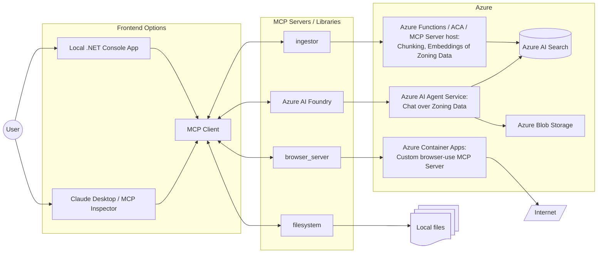

# Researcher Copilot for Localized Zoning Information

## Overview

Zoning rules and regulations are difficult things. There may be state, county, city, and/or subdivision rules that should be considered when looking at residential property construction. This copilot uses a combination of MCP Servers to provide the desired experience for the user.

Users may ask about zoning information for a location. The first path will be to use the Azure AI Agent Service to chat over zoning data. If the agent has no information for that location, it will use a combination of servers to:
- find and download zoning information (custom browser_server MCP server)
- save downloaded zoning information locally (filesystem MCP server)
- ingest/chunk/embedded downloaded information (custom ingestor MCP server)
- chat over zoning information (Azure AI Foundry MCP server for AI Agent Service)

### Solution Architecture



### Notes

- Why build our own **browser_server** MCP server?
   - [Playwright MCP](https://github.com/microsoft/playwright-mcp) supports a `browser_pdf_save` tool, but in testing that frequently created an invalid 1kb PDF document
   - [browser-use mcp server](https://github.com/co-browser/browser-use-mcp-server) seems overly convoluted; would prefer just use headless things versus trying to VNC stream browser, etc., but may still test if issues building our own
- Why use an Azure AI Agent Service agent?
   - Leverage platform support for integrating chat-over-your-data functionality

## Running the solution

### Prerequisites

Python projects:
   - Python 3.11 or greater ([Download Python](https://www.python.org/downloads/))
   - uv Python package and project manager tool ([Installing uv](https://docs.astral.sh/uv/getting-started/installation/))

.NET projects:
   - .NET 9.0 or greater ([Download .NET](https://dotnet.microsoft.com/en-us/download))

### Running the backend(s) or servers

> Note: This project defaults to SSE transport for local runs so that the server processes may be more easily debugged and monitored versus having the client manage via stdio. As a result, this guide expects that you will create separate terminal sessions per server and run them independently. Servers will need to be started before the client.

#### browser_server

To run the browser_server ready to respond to SSE requests:

```bash
cd src/mcp-servers/browser/python

# Run with SSE transport on port 8080
uv run browser_server --transport sse --port 8080
```

### Running the frontend or client

To run the .NET console application chat frontend:

```bash
cd src/mcp-client/console/csharp/MCPClient

dotnet run
```

## Server Tools Reference

### [browser_server](./src/mcp-servers/browser/python/pyproject.toml)

To add to MCP Client for SSE (assuming running on port 8080):
```json
{
    "servers": {
        "browser_server": {
            "url": "http://localhost:8080/sse",
            "transport": "sse"
        }
    }
}
```

| Tool | Description | Required Arguments |
|--|--|--|
| download_regulations | Browses to the zoning website for the specified location and downloads them to a local file or files. | `location` |
| download_file_from_url | Downloads the file from the given URL. | `url` |
| browse_for_regulation_information | Browses to the zoning website for the specified location and finds information to answer the provided question. | `location`, `question` |
