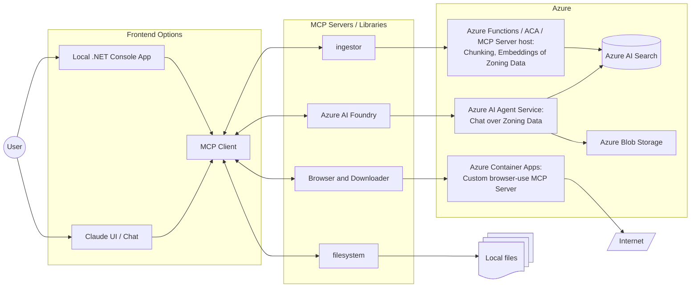

# Researcher Copilot for Localized Zoning Information

## Overview

Zoning rules and regulations are difficult things. There may be state, county, city, and/or subdivision rules that should be considered when looking at residential property construction. This copilot uses a combination of MCP Servers to provide the desired experience for the user.

Users may ask about zoning information for a location. The first path will be to use the Azure AI Agent Service to chat over zoning data. If the agent has no information for that location, it will use a combination of servers to:
- find and download zoning information (custom Browser and Downloader MCP server)
- save downloaded zoning information locally (filesystem MCP server)
- ingest/chunk/embedded downloaded information (custom ingestor MCP server)
- chat over zoning information (Azure AI Foundry MCP server for AI Agent Service)

### Solution Architecture



### Notes

- Why build our own **Browser** MCP server?
   - [Playwright MCP](https://github.com/microsoft/playwright-mcp) supports a `browser_pdf_save` tool, but in testing that frequently created an invalid 1kb PDF document
   - [browser-use mcp server](https://github.com/co-browser/browser-use-mcp-server) seems overly convoluted; would prefer just use headless things versus trying to VNC stream browser, etc., but may still test if issues building our own
- Why use an Azure AI Agent Service agent?
   - Leverage platform support for integrating chat-over-your-data functionality

## MCP Client

## MCP Server

```bash
cd src/mcp-server/

# Create a virtual environment for server
python -m venv .server-venv
source .server-venv/bin/activate

# Install prerequisites and dependencies
pip install -r requirements.txt
playwright install chromium

# Run the server
# TODO
```

### Tools

#### Downloader

Purpose: Uses [browser-use](https://github.com/browser-use/browser-use) to power an AI search of the web to find and download the zoning documentation available on public websites.

Arguments: Accepts a location

Prerequisites and dependencies:
- [Python](https://www.python.org/downloads/) >= 3.11
- [browser-use](https://github.com/browser-use/browser-use)
   - [Playwright](https://playwright.dev/)
   - [langchain-openai](https://python.langchain.com/docs/integrations/chat/openai/)